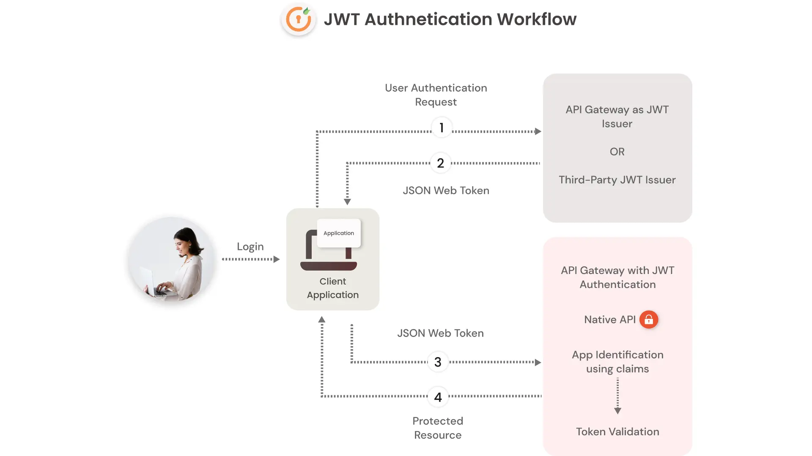

# Django - AuthServer

A RESTful api jwt authentication service provider for fronend applications.

### This project can be used with this ready frontend projects

1. Angular [tirtharajsinha/angular-auth](https://github.com/tirtharajsinha/angular-auth)
2. Next/React + Redux [github.com/tirtharajsinha/NEXTjwtAuth](https://github.com/tirtharajsinha/NEXTjwtAuth)

- also Can be used with any frameowrks.

1. Angular
2. React.js
3. Next.js
4. Nuxt.js
5. vue.js
6. vanila js
   etc...

### Install requirements

```
pip install -r requirements.txt
```

### Create .env file

```
JWT_SECRET="<JWT Secret key>"
SECRET_KEY="<Django Secret key>"
```

Generate Secret Key from here.

visit [https://www.cryptool.org/en/cto/openssl](https://www.cryptool.org/en/cto/openssl) and Run Command

```
openssl rand -bas64 32
```

### Run for first time

```
python manage.py makamigrations
python manage.py migrate
```

### Run Application

```
python manage.py runserver
```

### API ENDPOINTS

```js
- /api/register [POST]
takes ->
    {
        username:string,
        email:string,
        password:string
    }
return ->
    {
        id:int,
        username:string,
        email:string
    }


- /api/login [POST]
takes ->

    {
        email:string,
        password:string
    }

return ->

    {
        jwt:string
    },
    cookies: jwt


- /api/logout [POST]
takes ->
    {},
    cookies:jwt

return ->
    {
        message:string
    }


- /api/user [GET]
takes ->
    {},
    cookies:jwt
return ->
    {
        id:int,
        username:string,
        email:string
    }
```


